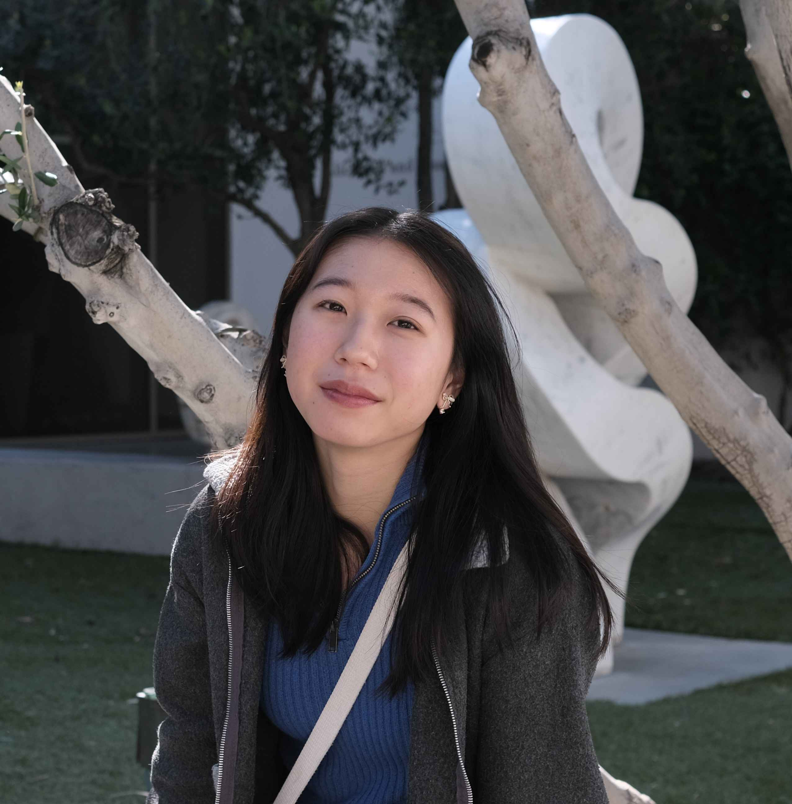

Hi, I'm Miri! I'm a senior undergrad at UCLA studying Computer Science and Mathematics, and I'm originally from Frederick, Maryland :)

I'm interested in natural language processing, especially neural machine translation, creative generation tasks, and NLP fairness.  At UCLA, I am an undergraduate research intern in the NLP Lab and the PLUS Lab.  Previously, I've also worked as a software engineering intern at Microsoft and Balyasny Asset Management.

In my free time, I like doing crosswords, reading, translating poetry, and playing guzheng.  I also play a lot of Pikmin Bloom!

[✉️ email](mailto:your.email@example.com)  [📄 cv](path/to/cv.pdf)  [💻 github](https://github.com/your-username)  [🔗 linkedin](https://linkedin.com/in/your-profile)

