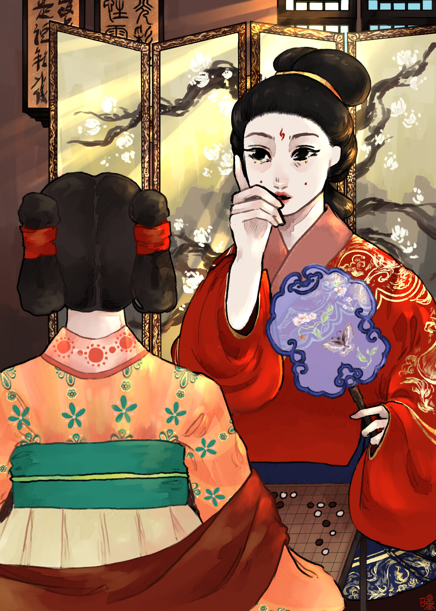
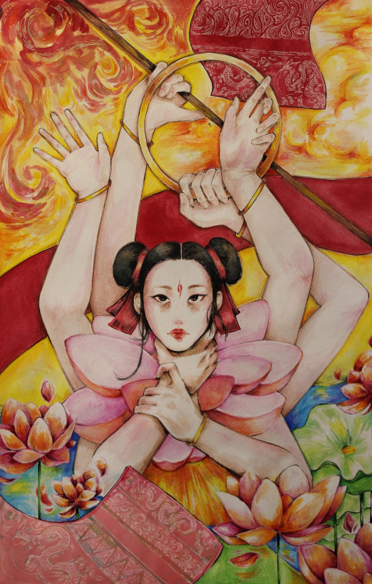
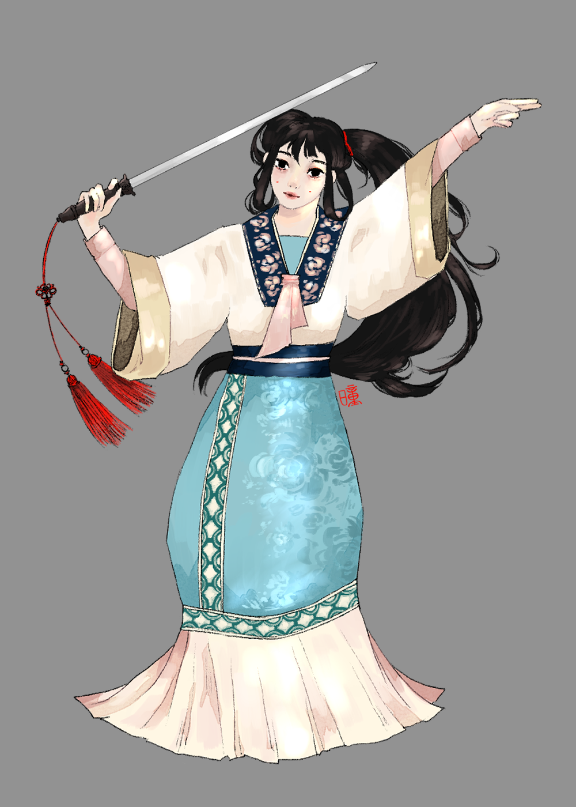
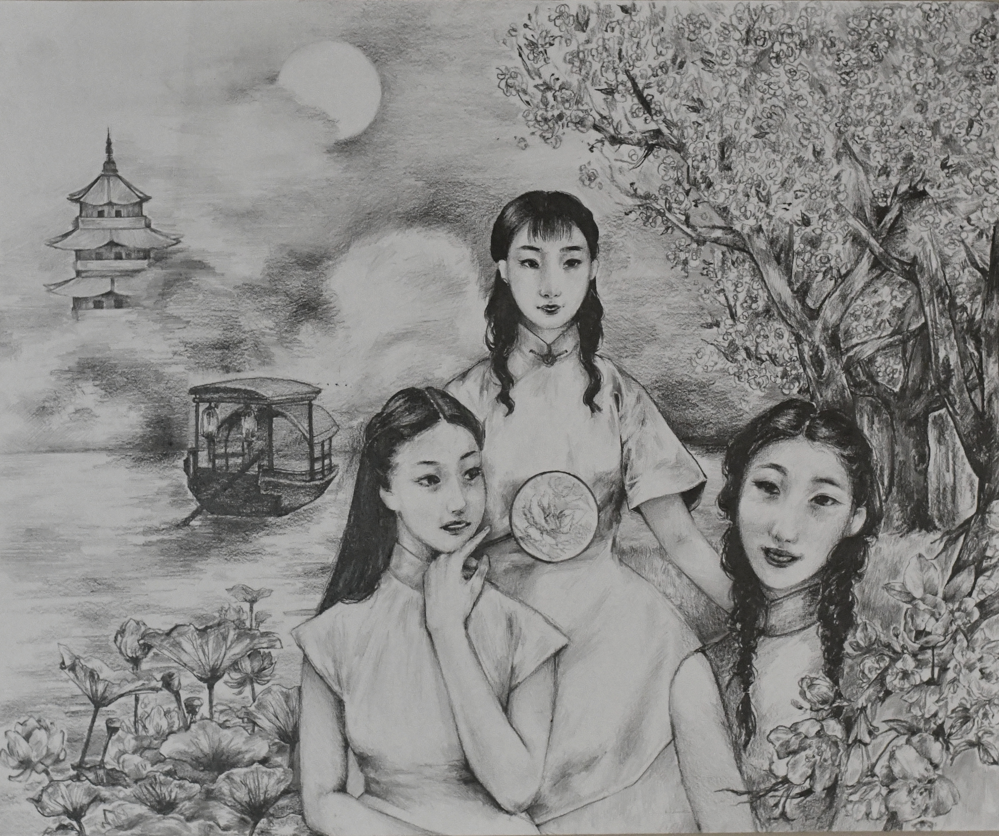
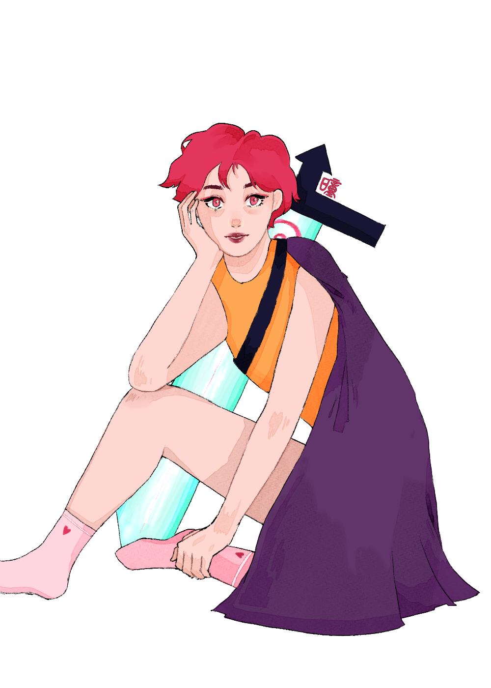

## Things I Like
**Books**:
* *Arcadia*, Tom Stoppard - I haven't read enough plays to make a plays section.
* *The Sing-Song Girls of Shanghai*, Han Bangqing
* *The Lost Conspiracy*, Frances Hardinge
* *Letters to a Young Poet*, Rainer Maria Rilke
* *Ex-Wife*, Ursula Parrott
* *长歌行*, Xia Da - if you ever try to read any Chinese-language graphic novel, it should be this one.  But it is unfinished :'(
* *Dune*, Frank Herbert
* *My Cousin Rachel*, Daphne du Maurier - I liked this one better than Rebecca :)
* *All the King's Men*, Robert Penn Warren - I read this as part of one of Professor Lowenstein's [CLAFI](http://www.clafi.ucla.edu/) seminars.  This is my personal vote for the Great American Novel, if such a thing exists.

**Art**:
* *Deer in Forest*, Franz Marc
* *Spring Rains*, Victor Higgins
* *Joan of Arc series*, Louis Maurice Boutet de Monvel
* *Turning Road*, Andre Derain
* Literally any Saint George and the Dragon, ever

**Misc**:
* Aviation history
* Natural history museums with animatronics
* Turkish Angora cats :)

## Things I've Done/Made
### Art
See my [Artstation](https://www.artstation.com/qmwhttr) for more pieces and hopefully for future updates.  Many of these are high school pieces because my college time management has not left art time </3
    
Click to see full image.

### Translation
Some sort of blog where each poem is a post to come.

### Dance
I'm a member of UCLA's Chinese Cultural Dance Club ([CCDC](https://ccdcbruins.wordpress.com/)), which has been a lot of fun :)

Some dances I was in:
* [Blossoming Pomegranates](https://www.youtube.com/watch?v=-AkonALceSs)
* [A Moonlit Trek](https://www.youtube.com/watch?v=GE6TlbbOrl8)
* [Pearl Curtain](https://www.youtube.com/watch?v=Ga4Gu_eN-0M)
* [City in the West](https://www.youtube.com/watch?v=9GpTQCHC4wI)
* [Welcoming Tea](https://www.youtube.com/watch?v=zzIToYGvrBM)